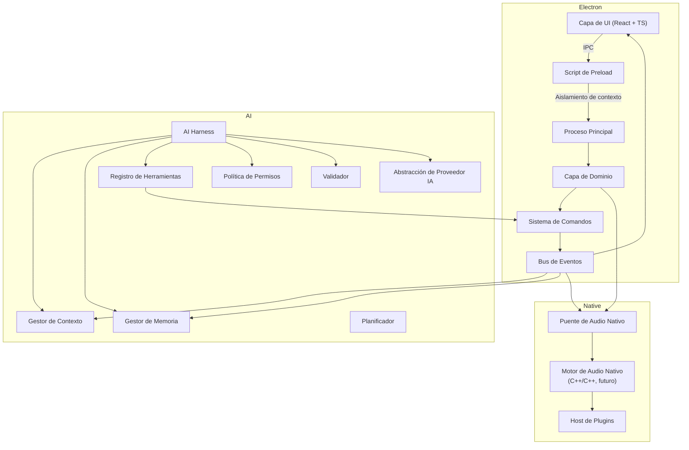

# Visión General de la Arquitectura

## 1. Misión

Jaswave es una **Estación de Trabajo de Audio Digital (DAW) AI-First**. El estado del DAW es la única fuente de verdad; la interfaz gráfica es solo una proyección visual de ese estado. La IA interactúa con el DAW exclusivamente a través de una capa de herramientas estructurada, nunca mediante observación de la UI.

## 2. Topología del Sistema



## 3. Principios de Diseño

| Principio | Implicación |
|-----------|-------------|
| **AI-First** | Todo el estado es consultable sin UI. Sin capturas de pantalla. |
| **DAW Determinista** | Las operaciones del DAW producen resultados repetibles. La IA es probabilística. |
| **Camino Único de Comandos** | UI, teclado, macros, scripts e IA ejecutan a través del mismo Command System. |
| **Undo/Redo Unificado** | Las acciones del usuario y la IA comparten la misma pila de deshacer/rehacer. |
| **Orientado a Eventos** | Todos los cambios de estado emiten eventos tipados. Los consumidores nunca hacen polling. |
| **Sin Mutación Directa de Estado** | El estado solo se modifica mediante comandos o transacciones. |
| **Descubrimiento de Capacidades** | El DAW se describe a sí mismo: herramientas, plugins y formatos disponibles. |

## 4. Límites de Módulos

| Módulo | Responsabilidad | Consumidores |
|--------|----------------|--------------|
| **Capa de Dominio** | Lógica de negocio pura para proyectos, tracks, clips, automatización, routing. | Command System, Validador, Event Bus |
| **Sistema de Comandos** | Registra, ejecuta y revierte comandos. Mantiene pilas de undo/redo. | UI, Herramientas de IA, Macros, Scripts |
| **Bus de Eventos** | Distribución de eventos tipados y ordenada. | UI, Contexto IA, Undo, Motor de Audio, Plugins, Extensiones |
| **Puente Nativo** | FFI/IPC entre Electron y el motor de audio. | Domain, Motor de Audio |
| **AI Harness** | Orquesta contexto, memoria, herramientas, permisos, validación y comunicación con el proveedor. | Chat UI, Command System |
| **Registro de Herramientas** | Descubre y describe herramientas disponibles para el proveedor de IA. | AI Harness, Gestor de Contexto |
| **Política de Permisos** | Aplica los niveles de autonomía definidos por el usuario. | Validador, AI Harness |

## 5. Flujo de Datos: Ejecución de Acción por IA

```
Entrada del Usuario / Sugerencia de IA
        │
        ▼
   AI Harness
        │
        ├──► Gestor de Contexto (recolectar estado)
        ├──► Registro de Herramientas (seleccionar herramientas)
        ├──► Planificador (secuenciar operaciones)
        │
        ▼
   Validador
        │
        ├── Validación de Schema
        ├── Validación de Permisos
        └── Validación de Estado del Proyecto
        │
        ▼
   Sistema de Comandos
        │
        ▼
   Transacción (multi-paso) / Comando (único)
        │
        ▼
   Capa de Dominio
        │
        ▼
   Bus de Eventos ──► Todos los Consumidores
        │
        ▼
   Pila de Undo/Redo
```

## 6. Restricciones Clave

1. **El hilo de audio es innegociable**: Nunca se bloquea, nunca asigna memoria dinámicamente, nunca llama al LLM.
2. **Aislamiento del Renderer**: El proceso de Renderer no puede acceder al sistema de archivos, motor de audio o proveedor de IA directamente.
3. **Estado serializable**: Todo el estado del DAW (excepto buffers de runtime) debe serializarse a JSON para consultas de IA y persistencia de proyectos.
4. **Sin capturas de pantalla**: La IA nunca observa la UI.
5. **Sin log-to-memoria**: Los logs operacionales no se promueven automáticamente a memoria de IA.
