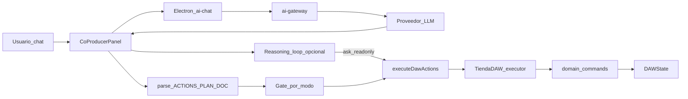

# 01 · Pipeline de comunicación

## Diagrama

## Pasos concretos

### 1. El usuario escribe en Asistente Jas

UI: `jas-wave/components/coproducer-panel.tsx`.

Se arma contexto (proyecto, selección, `plan.md`, menciones `@`) y el system prompt (`buildAgentSystemPrompt` en `jas-wave/src/lib/ai-daw-agent.ts`).

### 2. (Opcional) Bucle de razonamiento

Antes o junto al chat principal puede correr `runReasoningLoop` (`ai-harness` + `agent-reasoning-bridge.ts`).

- Herramientas de ese bucle: **solo lectura** (vía `executeDawActions` con modo `ask`).
- No crea pistas ni MIDI ahí.

### 3. Llamada al modelo

Renderer → `window.electron.aiChat(...)` → IPC `ai-chat` → `jas-wave/electron/ai-gateway.ts`.

Proveedores: Ollama, OpenAI, Anthropic, Gemini, OpenRouter, KiloCode, etc.  
La respuesta es **texto** (no tool-calls nativos del proveedor como única vía).

### 4. Parseo de la respuesta

Del texto se extraen bloques delimitados:

| Bloque | Parser | Efecto |
|--------|--------|--------|
| `<<<ACTIONS … ACTIONS>>>` | `parseActionsFromText` | Array `{ type, payload }` |
| `<<<PLAN … PLAN>>>` | `parsePlanFromText` | JSON de plan de proyecto (preview UI) |
| `<<<DOC slug … DOC>>>` | `parseDocBlocksFromText` | Escribe markdown en Docs (`plan.md`, etc.) |

El chat visible usa `stripActionsBlock` para no mostrar el JSON crudo.

### 5. Gate por modo

`detectAgentMode` / `modeBlocksMutation` (`ai-harness/src/agent/modes.ts`, espejo en `jas-wave/src/lib/ai-modes.ts`):

- **Consulta / Plan / Pensar** → no mutan (o fuerza `aplicar: false` en previews).
- **Crear** → ejecuta de verdad.

El usuario puede pulsar **Construir** para aplicar propuestas pendientes de Plan/Pensar.

### 6. Ejecución

`executeDawActions(tienda, actions, …)` en `ai-daw-agent.ts`:

- `case 'midi.clip.create':` → `tienda.executor.execute('midi.clip.create', …)`
- `case 'daw.musicBuild':` → `executeMusicBuild(...)` (orquestador, no un solo comando de dominio)
- igual para tracks, plugins, bounce, docs, etc.

### 7. Command System (shared)

`shared/src/commands/domain-commands.ts` (+ registry builtin):

- Valida payload
- Mutación determinista de `DAWState`
- Eventos de dominio
- Undo/redo

La IA **no escribe el estado a mano**: siempre pasa por comandos (o orquestadores que llaman comandos).

### 8. Después de mutar

- Sync / evaluación de `plan.md` (`agent-plan-eval` + `ai-harness/src/plan/eval.ts`)
- En modo **Crear**: harness `runHarnessUntilPlanComplete` puede pedir más turnos de reparación hasta que las tareas pendientes del plan estén OK o se agote el presupuesto.

## Archivos clave

| Pieza | Ruta |
|-------|------|
| Chat UI | `jas-wave/components/coproducer-panel.tsx` |
| Gateway LLM | `jas-wave/electron/ai-gateway.ts` |
| Acciones DAW | `jas-wave/src/lib/ai-daw-agent.ts` |
| Music Build | `jas-wave/src/lib/music-build/executor.ts` |
| Docs / plan.md | `jas-wave/src/lib/agent-docs.ts` |
| Modos | `ai-harness/src/agent/modes.ts` |
| Harness | `ai-harness/src/loop/harness.ts` |
| Comandos MIDI | `shared/src/commands/domain-commands.ts` |

Siguiente: [02 · plan.md y bloques](./02-plan-md-y-bloques.md).
