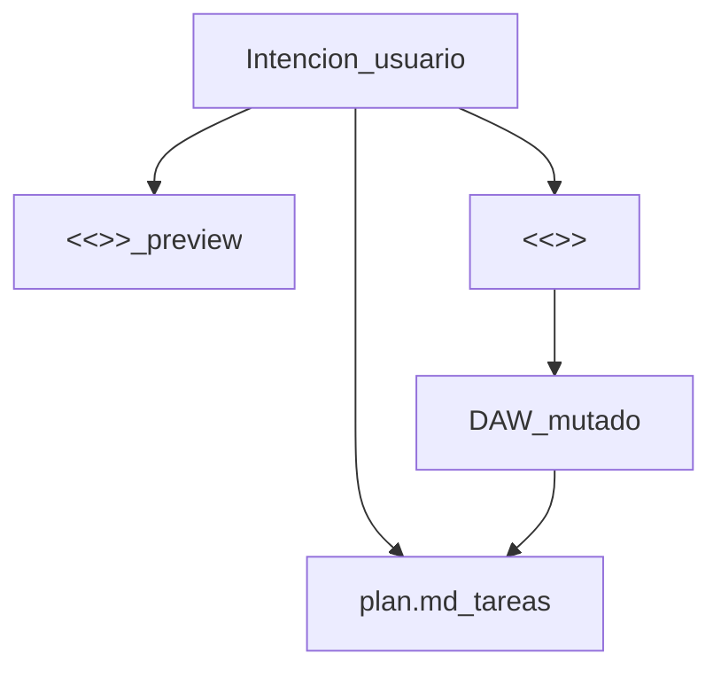

# 02 · plan.md y bloques de la IA

Hay **tres lenguajes** que la IA usa hacia JasWave: el archivo **`plan.md`**, el JSON **`<<<PLAN>>>`**, y el array **`<<<ACTIONS>>>`**.

---

## A) Archivo `plan.md` (Docs del proyecto)

Slug canónico: `plan.md` (`PLAN_SLUG` en `jas-wave/src/lib/agent-docs.ts`).

Plantilla por defecto:

```markdown
# Plan

## Intención
_Describe qué quieres producir…_

## Por implementar
- [ ] (añade tareas o pistas aquí)

## En curso

## Implementado

## Evaluación

## Notas del usuario
```

| Sección | Quién la usa | Rol |
|---------|--------------|-----|
| **Intención** | Usuario + IA | Objetivo de la producción |
| **Por implementar** | IA / harness | Tareas abiertas `- [ ]` (el eval lee estas) |
| **En curso** | IA / harness | Trabajo a medias |
| **Implementado** | IA / harness | Hecho `- [x]` |
| **Evaluación** | Sistema / IA | Resultado plan ↔ DAW (p. ej. listen tras bounce) |
| **Notas del usuario** | **Solo usuario** | La IA no debe pisarlas (`preserveUserNotes`) |

El evaluador (`ai-harness/src/plan/eval.ts`) clasifica checkboxes de Por implementar / En curso / Implementado (pista, VST, sidechain, bounce, etc.) contra el `DAWState` real.

Escritura típica en modo Plan/Pensar:

```text
<<<DOC plan.md
# Plan: Indie folk 96 BPM
## Intención
…
## Por implementar
- [ ] Pista «Guitarra» (guitar · VST …)
…
## Notas del usuario
DOC>>>
```

---

## B) Bloque `<<<PLAN>>>` (preview de proyecto)

JSON embebido en la respuesta del modelo (no es el mismo archivo que `plan.md`, aunque se complementan):

```text
<<<PLAN
{
  "nombre": "Demo",
  "bpm": 120,
  "tonalidad": "C mayor",
  "minutos": 1,
  "pensamiento": "…",
  "pistas": [
    { "nombre": "Piano", "rol": "piano", "tipo": "midi" }
  ]
}
PLAN>>>
```

Sirve para la UI de **vista previa de plan** (`project-plan`).  
La mutación real del DAW ocurre solo con **ACTIONS** ejecutadas (o Music Build con `aplicar: true`).

---

## C) Bloque `<<<ACTIONS>>>` (lo que se ejecuta)

```text
<<<ACTIONS
[
  { "type": "daw.musicBuild", "payload": { "aplicar": true, "prompt": "…", "bpm": 120 } },
  { "type": "track.create", "payload": { "nombre": "Pad", "tipo": "midi" } }
]
ACTIONS>>>
```

Cada elemento es `{ type, payload }`.

- `type` = comando de dominio (`midi.clip.create`) **o** orquestación cliente (`daw.musicBuild`, `library.preset.apply`, …).
- Catálogo: `jas-wave/src/lib/agent-action-catalog.ts` + system prompt en `ai-daw-agent.ts`.

### Ejemplo Music Build (preferido para canciones)

```json
{
  "type": "daw.musicBuild",
  "payload": {
    "aplicar": true,
    "prompt": "texto del usuario",
    "genero": "metal",
    "bpm": 140,
    "tonalidad": "E menor",
    "minutos": 2,
    "progresion": [1, 6, 3, 7],
    "secciones": [
      { "nombre": "Intro", "bars": 4, "degrees": [1, 1, 6, 6], "density": 0.4 },
      { "nombre": "Riff", "bars": 8, "degrees": [1, 6, 3, 7], "density": 0.95 }
    ],
    "pistas": [
      { "nombre": "Drums", "rol": "drums", "articulacion": "drums" },
      { "nombre": "Bass", "rol": "bass", "presetId": "…" }
    ]
  }
}
```

Aquí la IA define **arreglo / spec**, no el array de miles de notas.

### Ejemplo nota a nota (posible, menos habitual en canciones largas)

```json
{
  "type": "midi.clip.create",
  "payload": {
    "pistaId": "…",
    "nombre": "Riff",
    "inicio": 0,
    "duracion": 16,
    "notas": [
      { "pitch": 60, "inicio": 0, "duracion": 1, "velocidad": 90, "canal": 0 }
    ]
  }
}
```

---

## Relación entre los tres



1. **Plan.md** = contrato de tareas visibles (humano + harness).
2. **PLAN JSON** = snapshot creativo para UI.
3. **ACTIONS** = órdenes ejecutables.

Siguiente: [03 · Qué ejecuta la IA](./03-que-ejecuta-la-ia.md).
