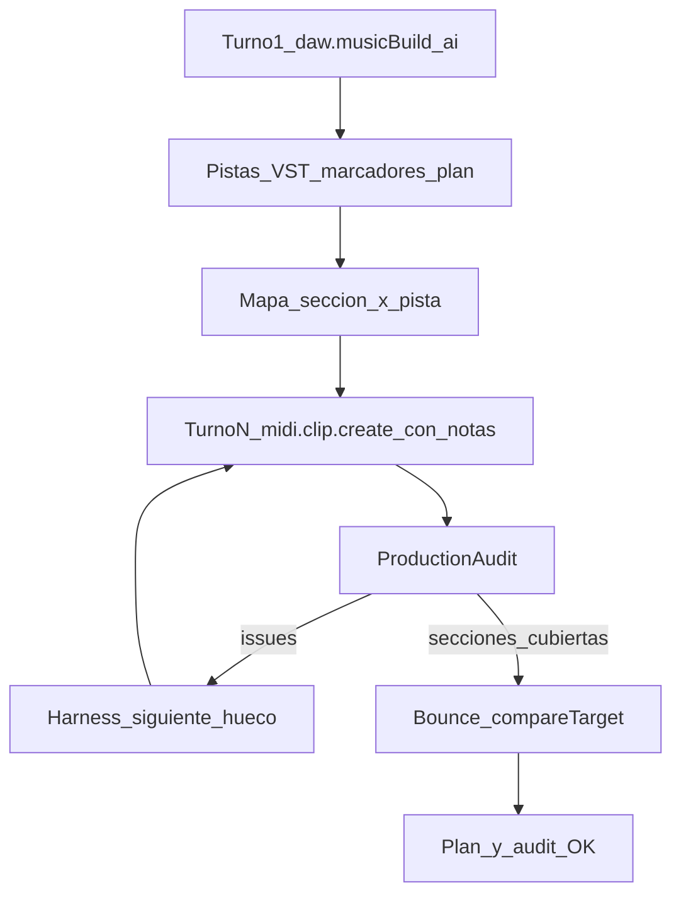
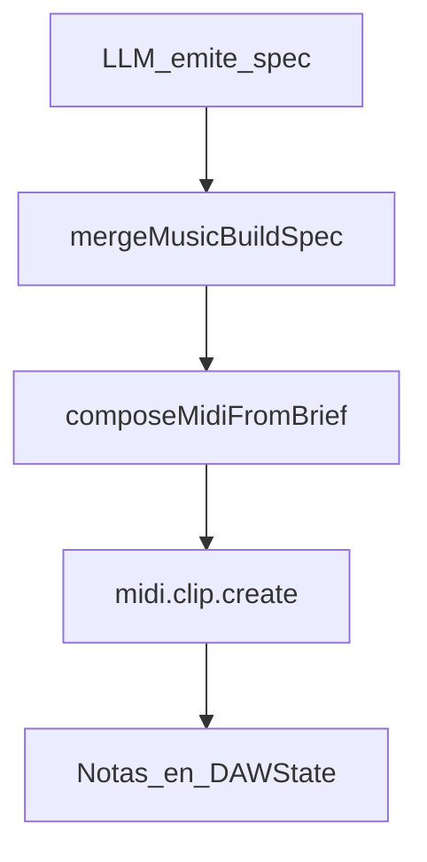

# 05 · Notas MIDI: ¿las configura la IA o el código?

## Respuesta directa (producto actual)

| Camino | ¿Quién decide pitch / tiempo / velocity de **cada** nota? |
|--------|------------------------------------------------------------|
| **Music Build** con `midiSource: "ai"` (**default**) | Estructura (BPM, marcadores, pistas, VST, vol/pan) + `plan.md` por sección×pista; **sin clips vacíos**. La IA inserta `midi.clip.create` **con notas[]** por hueco. |
| **Music Build** con `midiSource: "procedural"` (legado) | **El código** (`composeMidiFromBrief`), guiado por el *brief*/spec |
| **ACTIONS** `midi.clip.create` / `midi.notes.set` / `midi.notes.patch` | **La IA** (o la UI), nota a nota. `patch` crea el clip si falta cobertura. |
| **ACTIONS** `midi.clip.md.*` | **La IA** — camino opcional (tabla + preview); no es el feliz path de canciones |
| **Piano roll + Ctrl+L** | El usuario ancla notas; la IA opera sobre esos `noteIds` |
| **Piano roll humano** | El usuario |

**No** hay una melodía fija hardcodeada.  
**Sí** hay defaults de dominio (`canal=0`, `velocidad??80`, `presion=0`) y un generador procedural opcional.

---

## Flujo canción (camino feliz)

1. `daw.musicBuild { aplicar:true, midiSource:"ai", … }` crea BPM, marcadores, pistas, instrumentos y mezcla por rol. **No** crea clips vacíos ni `clip-*.md`. Escribe checkboxes en `plan.md`:
   `- [ ] MIDI «Drums» · sección Intro (beats 0–16) · {trackId} · rol drums`
2. El harness / Agent Loop pide el **siguiente hueco** y la IA emite `midi.clip.create { pistaId, inicio, duracion, notas:[...] }` (notas obligatorias).
3. Tras cada create/patch: audición corta + meters; el **auditor de producción** emite issues (VST, rango MIDI, huecos, mezcla, listen).
4. Cuando no quedan huecos: `render.start` + `analysis.compareTarget` (target `streaming` por defecto; `club`/`cd` según el plan/nombre).

### Selección tipo Cursor (Ctrl+L)

1. Selecciona notas en el piano roll → **Preguntar a Jas** o **Ctrl+L**.
2. Se ancla el contexto (`trackId`, `clipId`, `noteIds`, pitches…) al chat.
3. Pedidos del tipo «reordena esta secuencia» deben usar ACTIONS con esos `noteIds`.

---

## Camino legado procedural

Si `midiSource: "procedural"` (o se pide explícitamente preview rápida):

Ahí el código calcula pitch/inicio/duración/velocidad; la IA solo manda el brief (BPM, tonalidad, roles, secciones).

---

## Defaults del Command System

Archivo: `shared/src/commands/domain-commands.ts`.

| Campo | Si el payload no lo trae |
|-------|---------------------------|
| `velocidad` | **80** |
| `canal` | **0** |
| `id` | `generarId()` |
| `presion` | **0** |

Expresión (CC / bend): ACTIONS `midi.setCC` / `midi.setPitchBend`.

---

## Implicaciones

1. Canciones: Music Build (estructura) + turnos `midi.clip.create` con notas por sección; harness hasta completar huecos + audit limpio.
2. Prohibido `midi.clip.create` con `notas: []`.
3. `midi.notes.patch` crea el clip si el rango no está cubierto.
