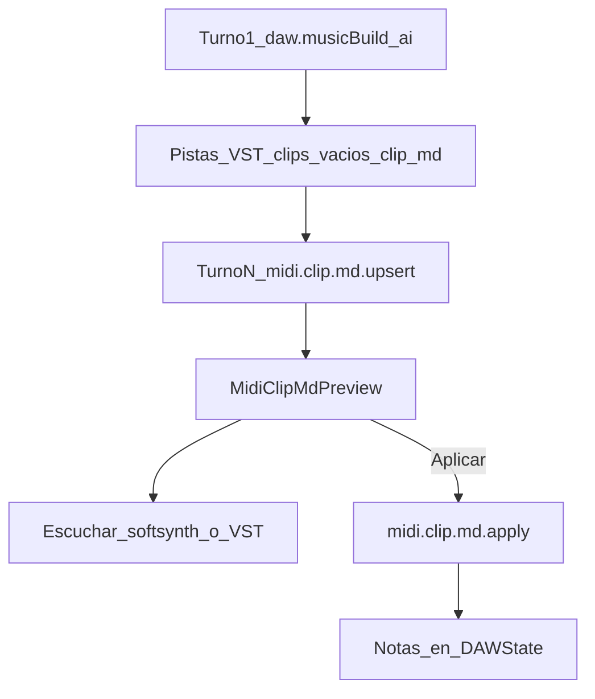
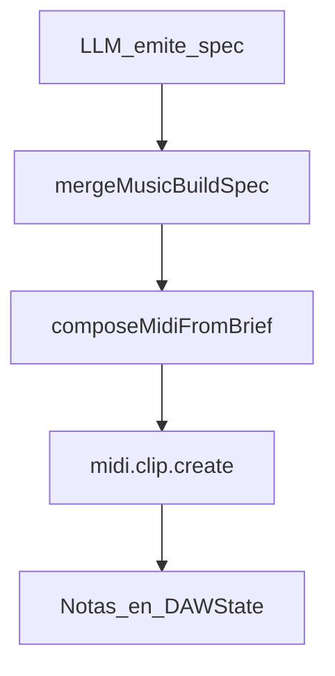

# 05 · Notas MIDI: ¿las configura la IA o el código?

## Respuesta directa (producto actual)

| Camino | ¿Quién decide pitch / tiempo / velocity de **cada** nota? |
|--------|------------------------------------------------------------|
| **Music Build** con `midiSource: "ai"` (**default**) | Estructura + stubs `clip-*.md`; **la IA** rellena el `.md` nota a nota (`midi.clip.md.upsert` → preview → `apply`) |
| **Music Build** con `midiSource: "procedural"` (legado) | **El código** (`composeMidiFromBrief`), guiado por el *brief*/spec |
| **ACTIONS** `midi.clip.md.*` | **La IA** — herramienta más precisa (tabla completa + ids estables) |
| **ACTIONS** `midi.clip.create` / `midi.notes.set` | **La IA** (o la UI), nota a nota (JSON directo) |
| **Piano roll + Ctrl+L** | El usuario ancla notas; la IA opera sobre esos `noteIds` |
| **Piano roll humano** | El usuario |

**No** hay una melodía fija hardcodeada.  
**Sí** hay defaults de dominio (`canal=0`, `velocidad??80`, `presion=0`) y un generador procedural opcional.

---

## Flujo canción (nota a nota vía `.md`)

1. `daw.musicBuild { aplicar:true, midiSource:"ai", … }` crea BPM, pistas, instrumentos, **clips vacíos** y Docs `clip-<clipId>.md` (tabla vacía). `plan.md` lista tareas por slug.
2. Cada turno: la IA lee `midi.clip.md.read`, escribe filas (id, pitch, inicio, duración, velocidad, …) con `midi.clip.md.upsert` → tarjeta de preview (no timeline).
3. Usuario: Escuchar (Plugin Host / motor de audio, o VST de pista) → **Aplicar al proyecto** (`midi.clip.md.apply` → `notes.set`).
4. `midi.notes.compare` para diff por id (md vs DAW u otro clip).

### Selección tipo Cursor (Ctrl+L)

1. Selecciona notas en el piano roll → **Preguntar a Jas** o **Ctrl+L**.
2. Se ancla el contexto (`trackId`, `clipId`, `noteIds`, pitches…) al chat.
3. Pedidos del tipo «reordena esta secuencia» deben usar ACTIONS con esos `noteIds` (o editar el `.md` y comparar).

---

## Camino legado procedural

Si `midiSource: "procedural"` (o se pide explícitamente preview rápida):

Ahí el código calcula pitch/inicio/duración/velocidad; la IA solo manda el brief (BPM, tonalidad, roles, secciones).

---

## Defaults del Command System

Archivo: `shared/src/commands/domain-commands.ts`.

| Campo | Si el payload no lo trae |
|-------|---------------------------|
| `velocidad` | **80** |
| `canal` | **0** |
| `id` | `generarId()` |
| `presion` | **0** |

Expresión (CC / bend): ACTIONS `midi.setCC` / `midi.setPitchBend` (también bloque `## Expresión` en el `.md`).

---

## Implicaciones

1. Canciones: Music Build (estructura + stubs md) + turnos `midi.clip.md.upsert` / `apply`; una pista/clip por turno.
2. El `.md` es la vista Cursor-like: cada nota es una fila identificable y comparable.
3. La timeline no cambia hasta **Aplicar** (preview en chat / Docs).
