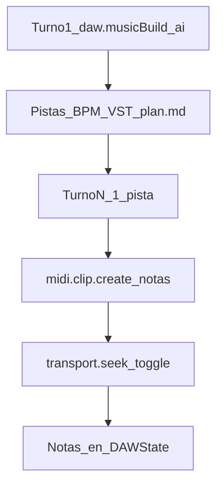
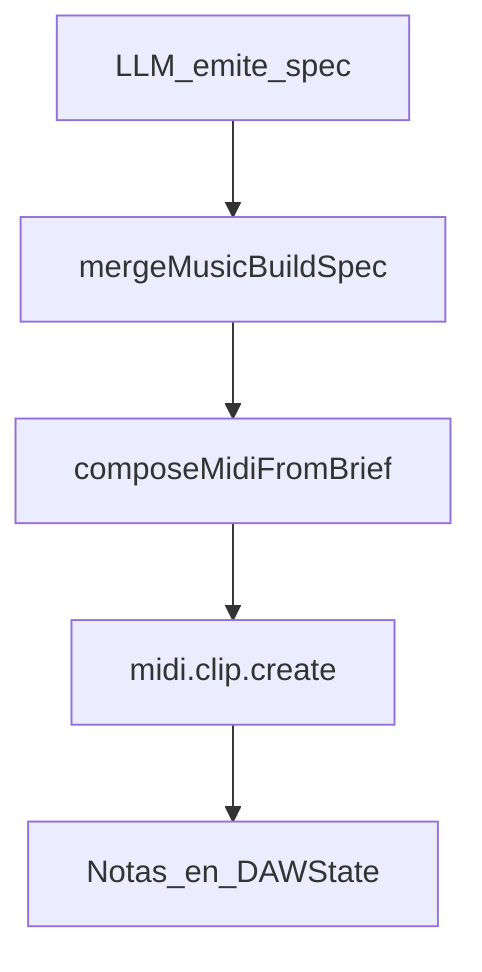

# 05 · Notas MIDI: ¿las configura la IA o el código?

## Respuesta directa (producto actual)

| Camino | ¿Quién decide pitch / tiempo / velocity de **cada** nota? |
|--------|------------------------------------------------------------|
| **Music Build** con `midiSource: "ai"` (**default**) | **La IA**, en turnos posteriores: `midi.clip.create` / `midi.notes.set` con `notas[]` |
| **Music Build** con `midiSource: "procedural"` (legado) | **El código** (`composeMidiFromBrief`), guiado por el *brief*/spec |
| **ACTIONS** `midi.clip.create` / `midi.notes.set` | **La IA** (o la UI), nota a nota |
| **Piano roll + Ctrl+L** | El usuario ancla notas; la IA opera sobre esos `noteIds` |
| **Piano roll humano** | El usuario |

**No** hay una melodía fija hardcodeada.  
**Sí** hay defaults de dominio (`canal=0`, `velocidad??80`, `presion=0`) y un generador procedural opcional.

---

## Flujo canción (nota a nota por la IA)

1. `daw.musicBuild { aplicar:true, midiSource:"ai", … }` crea estructura (BPM, pistas, instrumentos) y rellena `plan.md` con tareas «MIDI nota-a-nota» por pista. **No** escribe melodías.
2. Cada turno de creación siguiente: la IA analiza rol/secciones de **una** pista (o un clip) y emite `midi.clip.create` con `notas:[{pitch,inicio,duracion,velocidad},…]`.
3. Tras crear el clip (si `audition !== false`), el cliente hace seek + play corto para probar.
4. El harness sigue el plan hasta vaciar «Por implementar».

### Selección tipo Cursor (Ctrl+L)

1. Selecciona notas en el piano roll → botón flotante **Preguntar a Jas** o **Ctrl+L**.
2. Se ancla el contexto (`trackId`, `clipId`, `noteIds`, pitches…) al chat.
3. Pedidos del tipo «reordena esta secuencia / ponlas a tiempo» deben usar ACTIONS con esos `noteIds`.

---

## Camino legado procedural

Si `midiSource: "procedural"` (o se pide explícitamente preview rápida):

Ahí el código calcula pitch/inicio/duración/velocidad; la IA solo manda el brief (BPM, tonalidad, roles, secciones).

---

## Defaults del Command System

Archivo: `shared/src/commands/domain-commands.ts`.

| Campo | Si el payload no lo trae |
|-------|---------------------------|
| `velocidad` | **80** |
| `canal` | **0** |
| `id` | `generarId()` |
| `presion` | **0** |

Expresión (CC / bend): ACTIONS `midi.setCC` / `midi.setPitchBend`.

---

## Implicaciones

1. Canciones: Music Build (estructura) + turnos con `notas[]` explícitas; una pista por turno.
2. Motivo / edición: selección Ctrl+L + `midi.notes.set` / transpose / quantize con `noteIds`.
3. Solo usa procedural si el usuario pide preview rápida o `midiSource:"procedural"`.

Código: `jas-wave/src/lib/music-build/executor.ts`, `ai-daw-agent.ts`, `ai-selection-context.ts`, `midi-song-generator.ts` (legado).

Volver al [índice](./README.md).
