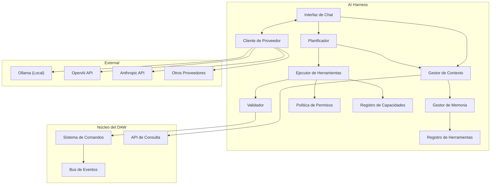

# Arquitectura de IA

## 1. Propósito

El AI Harness es el cerebro que conecta el DAW con proveedores externos de IA. Es agnóstico al proveedor, consciente del contexto, controlado por permisos y completamente observable. La IA nunca toca la UI ni el hilo de audio directamente.

## 2. Arquitectura



## 3. Responsabilidades de los Componentes

### Interfaz de Chat
Gestiona el estado de la conversación, manejo de streaming e historial de mensajes. NO interpreta la respuesta de la IA.

```typescript
interface ChatInterface {
  sendMessage(message: string): Promise<AIResponse>;
  sendMessageStream(message: string): AsyncIterable<AIResponseChunk>;
  getHistory(): ConversationTurn[];
  clearHistory(): void;
}
```

### Planificador
Convierte respuestas de texto/llamadas de herramientas de la IA en planes ejecutables. Puede solicitar ejecución de herramientas, pedir aclaraciones o generar preguntas de confirmación.

```typescript
interface Planner {
  plan(response: AIResponse, context: AIContext): ExecutionPlan;
}

interface ExecutionPlan {
  steps: PlanStep[];
  requiresConfirmation: boolean;
  estimatedRisk: RiskLevel;
  summary: string;
}

type PlanStep = ToolCall | Clarification | ConfirmationRequest;
```

### Ejecutor de Herramientas
Ejecuta las herramientas devueltas por el Planificador. Maneja verificaciones de permisos, validación y formato de resultados.

```typescript
interface ToolRunner {
  execute(toolCall: ToolCall, context: ToolContext): Promise<ToolResult>;
  executeBatch(toolCalls: ToolCall[]): Promise<ToolResult[]>;
}
```

### Validador
Ejecuta la pipeline de validación antes de que cualquier herramienta se ejecute. (Ver `VALIDACION.md`)

### Gestor de Contexto
Ensambla la ventana de contexto de la IA a partir de los 5 niveles. (Ver `GESTOR-CONTEXTO.md`)

### Gestor de Memoria
Gestiona memorias de corto plazo, sesión, largo plazo y proyecto. (Ver `GESTOR-MEMORIA.md`)

### Registro de Herramientas
Descubre y describe las herramientas disponibles. (Ver `REGISTRO-HERRAMIENTAS.md`)

### Política de Permisos
Aplica el nivel de autonomía del usuario. (Ver `PERMISOS.md`)

### Registro de Capacidades
Expone capacidades del DAW (formatos, hardware, características) para `getCapabilities()`.

### Cliente de Proveedor
Abstrae el proveedor de IA. (Ver `PROVEEDOR-IA.md`)

## 4. Ciclo de Vida de una Solicitud

```
Mensaje del Usuario
    │
    ▼
Interfaz de Chat
    │
    ├──► Gestor de Contexto (ensamblar ventana de contexto)
    │       ├── Estado inmediato
    │       ├── Estructura del proyecto
    │       ├── Eventos recientes
    │       ├── Memoria de sesión
    │       └── Memoria persistente
    │
    ├──► Registro de Herramientas (inyectar definiciones de herramientas)
    │
    ▼
Cliente de Proveedor (enviar a Ollama / OpenAI / etc.)
    │
    ▼
Respuesta de IA
    │
    ├── Respuesta de texto → mostrar al usuario
    ├── Llamadas de herramientas → Planificador → Ejecutor de Herramientas → Validador → Sistema de Comandos
    └── Aclaración → preguntar al usuario
```

## 5. Streaming

Para proveedores con streaming (Ollama, SSE de OpenAI), el AI Harness soporta actualizaciones incrementales:

```typescript
interface AIResponseChunk {
  type: 'text_delta' | 'tool_call_start' | 'tool_call_delta' | 'tool_call_stop' | 'done';
  delta?: string;
  toolCall?: ToolCall;
}
```

El streaming se consume en la UI para mostrar el "pensamiento" de la IA en tiempo real.

## 6. Manejo de Errores

```typescript
interface AIError {
  code: 'PROVIDER_ERROR' | 'CONTEXT_OVERFLOW' | 'VALIDATION_FAILED' | 'TOOL_EXECUTION_FAILED' | 'PERMISSION_DENIED' | 'TIMEOUT';
  message: string;
  recoverable: boolean;
  details?: unknown;
}
```

Los errores se categorizan como:
- **Recuperables**: La IA puede reintentar o pedir aclaración (ej: error de validación).
- **Fatales**: La sesión debe reiniciarse (ej: proveedor inalcanzable).

## 7. Observabilidad

El AI Harness registra cada interacción para depuración y auditoría:

```typescript
interface AIInteractionLog {
  id: string;
  timestamp: number;
  userMessage: string;
  contextHash: string;
  response: AIResponse;
  toolCalls: ToolCallLog[];
  errors: AIError[];
  latencyMs: number;
}
```

**Importante**: Este log es telemetría operacional. NO se promueve automáticamente a Memoria de IA.

## 8. Límite de Determinismo

```
Salida IA ──probabilística──► Plan de Ejecución ──determinístico──► Llamadas de Herramientas ──determinístico──► Estado del DAW
```

La IA puede sugerir cosas diferentes para la misma entrada. La ejecución de esas sugerencias es completamente determinista y reproducible.

## 9. Garantías de Seguridad

1. **Sin acceso directo al estado**: La IA solo ve el contexto ensamblado por el Gestor de Contexto.
2. **Sin acceso directo al audio**: La IA nunca recibe buffers de audio en bruto.
3. **Sin observación de la UI**: La IA nunca ve capturas de pantalla ni estado de UI (excepto estado de UI de alto nivel como track seleccionado, que forma parte del estado del DAW).
4. **Sin ejecución de código**: La IA nunca ejecuta código arbitrario. Solo llama a herramientas pre-registradas.
5. **Controlada por permisos**: Cada llamada de herramienta se verifica contra el nivel de permiso del usuario.
6. **Validada**: Cada llamada de herramienta se valida antes de ejecutarse.
7. **Auditable**: Cada llamada de herramienta se registra.
